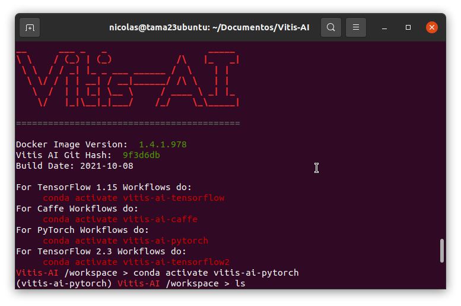

Primero clonar el repo de Vitis-AI

```console
git clone -b 1.4.1 https://github.com/Xilinx/Vitis-AI
```

Luego bajar el docker construido de vitis AI
```console
cd Vitis-AI/
docker pull xilinx/vitis-ai-cpu:1.4.1.978
```
Luego Ejectura el docker:
```console
./docker_run.sh xilinx/vitis-ai-cpu:1.4.1.978
```

Ya dentro del docker:
Activar el entorno de pytorch:

```console
conda activate vitis-ai-pytorch
```

 


Creo un directorio, donde clono este repo:
```console
mkdir custom_ai_models
cd custom_ai_models/
```


Es necesario instalar el siguiente paquete para descargar el dataset:
```console
pip install request
```

## 1. Descargar Dataset:
Ejecutar:
```console
python ./code/download_dataset.py 
```
